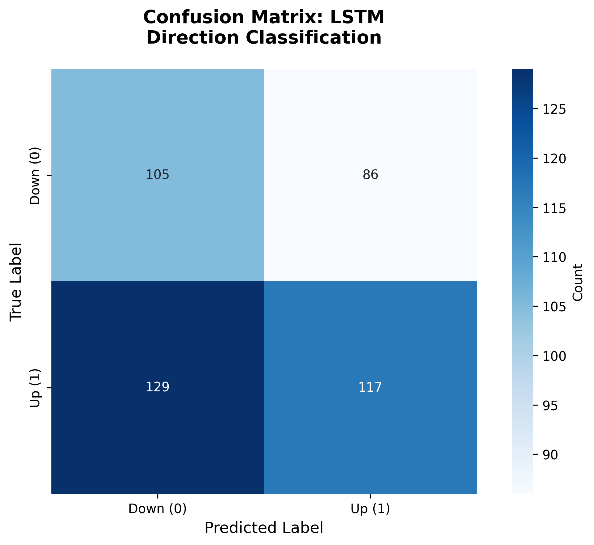
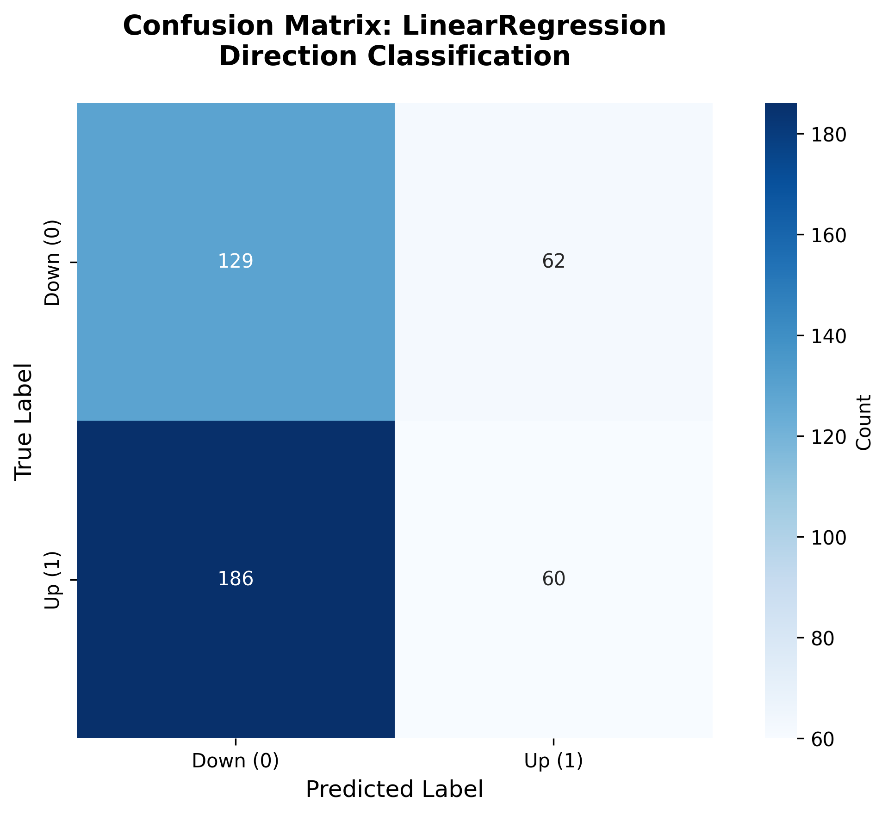
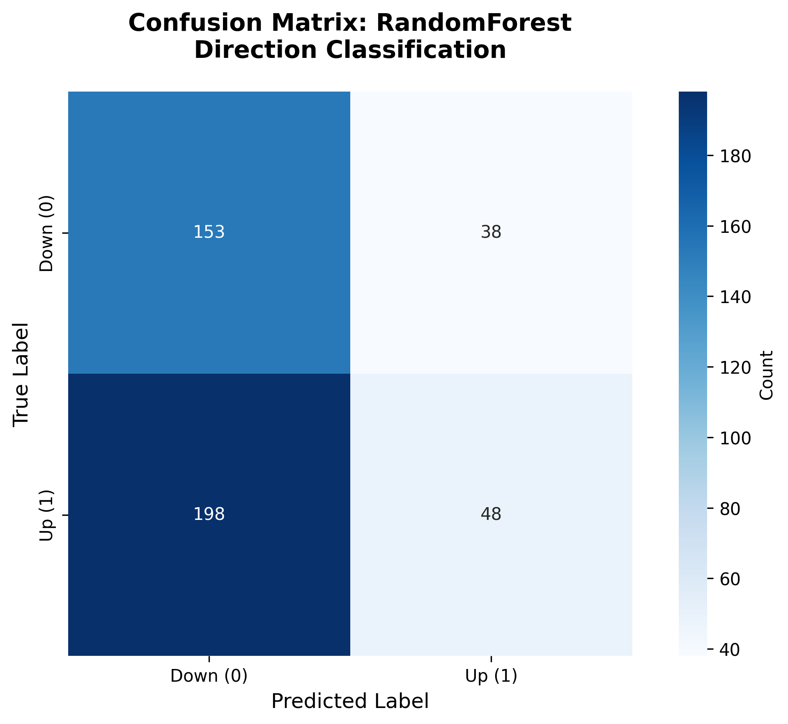
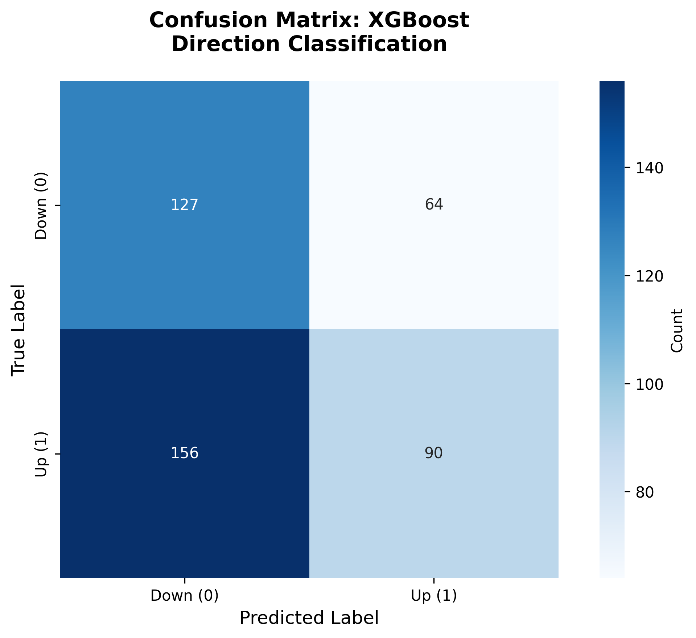

# LSTM S&P 500 Forecasting Project


> [!CAUTION]
> Negative potential consequences of an action.

This project builds an end-to-end pipeline to forecast next-day percentage returns and direction (Up/Down) for the S&P 500 using:

- 12 technical indicators
- A stacked LSTM model (TensorFlow / Keras)
- Baseline models (Linear Regression, Random Forest, XGBoost)
- A time-based train/test split (default: 2018–2022 train, 2023–2024 test)

The code follows a simplified 3-file structure under `src/`:

- **Source files**: `src/data_loader.py`, `src/models.py`, `src/evaluation.py`
- **Entry point**: `main.py`
- **Data folders**: `data/raw/`, `data/processed/`, `data/lstm/`, `results/`
- **Notebooks**: `notebooks/exploration.ipynb`

---

## Key Features

- **12 Technical Indicators**: RSI, MACD, Bollinger Bands, SMA, EMA, OBV, ATR, and more
- **Stacked LSTM Architecture**: 2-layer deep learning model with dropout regularization
- **Comprehensive Baselines**: Linear Regression, Random Forest, XGBoost for comparison
- **Hyperparameter Tuning**: Grid search for baselines, random search for LSTM (~40 min)
- **Class Imbalance Handling**: Balanced sample weights for fair model comparison
- **Time-Based Validation**: Proper temporal split (2018-2022 train, 2023-2024 test)
- **Dual Task**: Predicts both return magnitude (regression) and direction (classification)
- **Full Reproducibility**: Random seeds set for consistent results across runs
- **Rich Visualizations**: Confusion matrices for all models
- **Modular Design**: Clean separation of concerns with src/ layout
- **Comprehensive Tests**: >70% code coverage with pytest

---

## 1. Setup (once)

### Option A: Using pip and virtualenv

From the project root:

```bash
python3 -m venv .venv
source .venv/bin/activate
pip install -r requirements.txt
```

### Option B: Using conda

```bash
conda env create -f environment.yml
conda activate kevin-lstm
```

Recommended Python version: **3.9–3.12** (TensorFlow does not yet support Python 3.13+).

---

## 2. Configuration (`src/data_loader.py`)

All main project settings are centralized at the top of:

* `src/data_loader.py`

The rest of the modules read from this file and **do not** hard-code dates or hyperparameters.

Configuration constants:

```python
# Ticker to download (S&P 500 index)
TICKER = "^GSPC"

# Raw download date range
START_DATE = "2018-01-01"
END_DATE   = "2024-12-31"

# Train / test split boundaries
TRAIN_END  = "2022-12-31"
TEST_START = "2023-01-01"

# LSTM lookback window (number of past days)
LOOKBACK = 64

# LSTM hyperparameters
LSTM_CONFIG = {
    "units1": 64,
    "units2": 32,
    "dropout": 0.2,
    "batch_size": 32,
    "epochs": 50,
    "learning_rate": 1e-3,
}
```

These values are used by:

* `src.data_loader` for ticker, download, features, and preprocessing
* `src.models` for the LSTM architecture and training
* `src.evaluation` for model evaluation and visualization
* `main.py` to orchestrate everything

If you change any of these constants, the whole pipeline will adapt automatically on the next run.

> **Note**: If you significantly change `START_DATE` / `END_DATE` after you already generated data, delete existing files under `data/raw/`, `data/processed/`, and `data/lstm/` so the pipeline can rebuild everything using the new configuration.

---

## 3. Run the full pipeline

Once the environment is activated, run the evaluation pipeline.

### Quick Start
The dataset and tuned hyperparameters are already included in the repository, so you can run the pipeline immediately. The standard python main.py includes tuned hyperparameters so it's not necessary to run hyperparameter tuning.

```bash
python main.py
```

### All Available Commands

```bash
python main.py                    # Train/evaluate LSTM + baselines (uses tuned params)
python main.py --tune             # (Optional) Re-run hyperparameter tuning (~40 min)
python main.py --no-tuned         # Use default parameters instead of tuned
```

**Using conda:**
```bash
conda activate kevin-lstm
python main.py
```

This will:

1. **Download raw data** with `yfinance` (if the raw CSV does not exist), using:

   * `config.TICKER`
   * `config.START_DATE`
   * `config.END_DATE`

   and save to `data/raw/sp500_YYYY_YYYY.csv`.

2. **Build features & targets** (12 technical indicators + next-day return & direction) based on the raw data and save them to:

   * `data/processed/sp500_YYYY_YYYY_features_targets.csv`

3. **Preprocess data for LSTM** via `src.data_loader`:

   * Time-based split using `config.TRAIN_END` and `config.TEST_START`
   * MinMax scaling of the 12 indicators
   * Creation of 3D sequences `[samples, config.LOOKBACK, 12]` for the LSTM
   * Arrays and scaler stored under `data/lstm/`:

     * `X_train_seq.npy`, `y_train_reg_seq.npy`, `y_train_cls_seq.npy`
     * `X_test_seq.npy`, `y_test_reg_seq.npy`, `y_test_cls_seq.npy`
     * `feature_scaler.joblib`

4. **Train the LSTM model** via `src.models`:

   * Stacked LSTM layers with sizes/dropout from `config.LSTM_CONFIG`
   * `Dense(1, linear)` output for next-day percentage return
   * Early stopping and learning-rate reduction on plateau
   * Saves models and test predictions under `data/lstm/`:

     * `lstm_model_best.keras`
     * `lstm_model_final.keras`
     * `y_pred_reg_lstm.npy` (continuous % returns)
     * `y_pred_dir_lstm.npy` (Up/Down labels from predicted sign)

5. **Train baseline models and evaluate all models** via `src.evaluation`:

   * Baselines (trained on flat features):

     * Linear Regression
     * Random Forest Regressor
     * XGBoost Regressor
   * LSTM (using the saved predictions)
   * Metrics on the test set:

     * **RMSE**, **MAE** (magnitude of next-day return)
     * **Accuracy**, **F1** (direction, using sign of predicted return)
   * Results are printed and saved to:

     * `results/model_comparison.csv`

### 3.5 Hyperparameter Tuning (Optional)

The pipeline includes an optional hyperparameter tuning step that optimizes all models:

```bash
python main.py --tune
```

**What gets tuned:**

| Model | Method | Parameters Tuned |
|-------|--------|------------------|
| LinearRegression | Grid Search | Classification threshold |
| RandomForest | Grid Search | n_estimators, max_depth, min_samples_split, threshold |
| XGBoost | Grid Search | n_estimators, learning_rate, max_depth, gamma, threshold |
| LSTM | Random Search | units, dropout, learning_rate, batch_size, loss, **threshold** |

**Threshold Tuning:**

All models include optimal threshold tuning for direction prediction. Thresholds are applied to raw return predictions and found using quantile-based search on validation data.

**Class Imbalance Handling:**

The baseline models (RandomForest, XGBoost) use balanced sample weights during training to prevent them from exploiting class imbalance.

Tuned parameters are saved to `data/tuning/best_params.json` and automatically loaded in subsequent runs.

---

## 4. Results & Visualizations

After running the pipeline, you'll find comprehensive model performance metrics and visualizations in the `results/` directory.

### Model Comparison

Results on the test set (2023-2024) with tuned hyperparameters:

| Model | RMSE | MAE | Accuracy | F1 Score | Precision | Recall |
|-------|------|-----|----------|----------|-----------|--------|
| **LSTM** | **0.776** | **0.588** | 48.7% | 0.446 | **0.570** | 0.366 |
| RandomForest | 0.995 | 0.810 | 47.1% | **0.476** | 0.538 | **0.427** |
| XGBoost | 1.086 | 0.878 | **49.7%** | 0.450 | 0.584 | 0.366 |
| LinearRegression | 1.157 | 0.896 | 43.2% | 0.326 | 0.492 | 0.244 |

Lower RMSE/MAE indicates better return magnitude prediction. Higher Accuracy/F1 indicates better direction classification.

> **Key Insight**: The LSTM model achieves the best regression metrics (lowest RMSE/MAE), demonstrating its ability to capture temporal patterns in stock data. Stock direction prediction is inherently difficult (random baseline ~50%), and all models hover around this baseline for accuracy.

### Confusion Matrices

Direction classification performance for each model is visualized:

<table>
<tr>
<td></td>
</tr>
<tr>
<td align="center"><em>LSTM Model</em></td>
</tr>
</table>

**Baselines**
<table>
<tr>
<td></td>
<td></td>
<td></td>
</tr>
<tr>
<td align="center"><em>Linear Regression</em></td>
<td align="center"><em>Random Forest</em></td>
<td align="center"><em>XGBoost</em></td>
</tr>
</table>

*Confusion matrices show the classification accuracy for Up vs Down predictions. Diagonal values indicate correct predictions.*

All visualizations are automatically generated when you run `python main.py` and saved to `results/`.

### Interactive Exploration

An interactive Jupyter notebook is provided for exploring the data and results:

```bash
jupyter notebook notebooks/exploration.ipynb
```

The notebook includes:
- Data loading and inspection
- Target distribution analysis
- Technical indicators visualization
- Feature correlation heatmaps
- Model comparison charts
- Confusion matrices
- Summary insights

---

## 5. Project Structure

```
kevin-lstm/
├── src/
│   ├── data_loader.py           # Data download, feature engineering, preprocessing
│   ├── models.py                # LSTM and baseline models
│   ├── evaluation.py            # Model evaluation and visualization
│   └── hyperparameter_tuning.py # Grid/random search for all models
├── notebooks/
│   └── exploration.ipynb        # Interactive data exploration
├── tests/                       # Test suite (pytest)
├── data/
│   ├── raw/                     # Downloaded S&P 500 data
│   ├── processed/               # Features and targets
│   ├── lstm/                    # LSTM sequences and models
│   └── tuning/                  # Saved tuned hyperparameters
├── results/                     # Visualizations and metrics
├── main.py                      # Pipeline entry point
├── environment.yml              # Conda environment
└── requirements.txt             # pip dependencies
```

## 6. Running each step manually (optional)

You can import and run individual functions from Python for debugging:

### 6.1. Download data

```python
from src.data_loader import download_and_save_raw_data
download_and_save_raw_data(force=True)
```

### 6.2. Build features & targets

```python
from src.data_loader import build_and_save_feature_target_dataset
build_and_save_feature_target_dataset()
```

* Loads the raw CSV from `data/raw/`.

* Computes 12 technical indicators:

  * RSI (14)
  * MACD line + MACD histogram
  * Bollinger Bands (lower band + %B)
  * SMA_50
  * EMA_20
  * OBV
  * Normalized close price
  * Normalized daily volume
  * Lagged log return (t-1)
  * ATR (14)

* Computes two targets:

  * `next_day_return` (simple percentage return, in %)
  * `next_day_direction`:

    * `1` if `next_day_return > 0`
    * `0` otherwise

* Drops warm-up rows with NaNs and the last row (no next-day target).

* Saves to:

  * `data/processed/sp500_YYYY_YYYY_features_targets.csv`

### 6.3. Preprocess for LSTM

```python
from src.data_loader import prepare_lstm_data
prepare_lstm_data()
```

* Loads the processed dataset from `data/processed/`.

* Splits by date using `config.TRAIN_END` and `config.TEST_START`:

  * Train: up to `TRAIN_END` (inclusive)
  * Test: from `TEST_START` (inclusive)

* Scales the 12 indicators with `MinMaxScaler` (fit on train, apply to test).

* Builds LSTM sequences with a lookback window of `config.LOOKBACK` trading days:

  * `X_train_seq` shape: `(n_train_sequences, LOOKBACK, 12)`
  * `X_test_seq` shape:  `(n_test_sequences,  LOOKBACK, 12)`

* Creates aligned regression and classification targets at the **last day in the window**:

  * `y_train_reg_seq`, `y_train_cls_seq`
  * `y_test_reg_seq`, `y_test_cls_seq`

* Saves arrays and the scaler to:

  * `data/lstm/X_train_seq.npy`
  * `data/lstm/y_train_reg_seq.npy`
  * `data/lstm/y_train_cls_seq.npy`
  * `data/lstm/X_test_seq.npy`
  * `data/lstm/y_test_reg_seq.npy`
  * `data/lstm/y_test_cls_seq.npy`
  * `data/lstm/feature_scaler.joblib`

### 6.4. Train the LSTM model

```python
from src.models import train_and_evaluate_lstm
train_and_evaluate_lstm()
```

* Loads the LSTM-ready arrays from `data/lstm/`.

* Builds a stacked LSTM model using `config.LSTM_CONFIG`:

  * `LSTM(units1, return_sequences=True)` → `Dropout(dropout)`
  * `LSTM(units2)` → `Dropout(dropout)`
  * `Dense(1, activation="linear")` (regression output)

* Trains to predict `next_day_return` (in %) with:

  * `batch_size = config.LSTM_CONFIG["batch_size"]`
  * `epochs = config.LSTM_CONFIG["epochs"]`
  * `learning_rate = config.LSTM_CONFIG["learning_rate"]`

* Uses EarlyStopping + ReduceLROnPlateau + ModelCheckpoint.

* After training:

  * Saves the best model to `data/lstm/lstm_model_best.keras`
  * Saves the final model to `data/lstm/lstm_model_final.keras`
  * Predicts test returns → `data/lstm/y_pred_reg_lstm.npy`
  * Derives test directions (`> 0` → Up) → `data/lstm/y_pred_dir_lstm.npy`

### 6.5. Train baseline models and evaluate all models

```python
from src.evaluation import evaluate_all_models
evaluate_all_models()
```

* Loads the processed dataset and applies the same time-based train/test split.

* Scales features with `MinMaxScaler` (fit on train, transform test).

* Trains three baselines on `next_day_return`:

  * `LinearRegression`
  * `RandomForestRegressor`
  * `XGBRegressor`

* To compare fairly with LSTM, it evaluates baselines on the **same subset** of the test set as the LSTM sequences (i.e. it drops the first `LOOKBACK - 1` test samples).

* Loads LSTM test predictions from `data/lstm/`.

* Evaluates all models (baselines + LSTM) using:

  * **RMSE**, **MAE** (regression magnitude)
  * **Accuracy**, **F1** (direction classification)

* Prints a comparison table such as:

  * `model, rmse, mae, accuracy, f1`

* Saves the comparison table to:

  * `results/model_comparison.csv`

This CSV can be used directly in the project report to show that the LSTM outperforms the baselines (lower RMSE/MAE and higher Accuracy/F1, if everything is configured correctly).

## 7. Tests

A small test suite is provided to validate the core logic (feature engineering, preprocessing, models, evaluation, and pipeline imports).

### 7.1. Install test dependencies

From the project root, after creating/activating the virtualenv:

```bash
source .venv/bin/activate
pip install -r requirements-dev.txt
```

If you prefer installing only the minimal dependencies for testing:

```bash
pip install pytest pytest-cov
```

### 7.2. Run all tests

**IMPORTANT**: You must activate the virtualenv before running tests.

From the project root:

**Using virtualenv:**
```bash
source .venv/bin/activate
pytest tests/
```

**Using conda:**
```bash
conda activate kevin-lstm
pytest tests/
```

This will run all tests under the `tests/` directory.

**Troubleshooting:**
- If you get `pytest: command not found`, the virtualenv is not activated
- Alternatively, run without activating: `.venv/bin/pytest tests/`
- For verbose output, add `-v`: `pytest tests/ -v`

### 7.3. Run tests with coverage

To measure coverage for the `src` modules (with virtualenv activated):

```bash
pytest --cov=src --cov-report=term-missing tests/
```

This prints a line-by-line summary to the terminal, including which lines are not covered.

You can also generate an HTML coverage report:

```bash
pytest --cov=src --cov-report=html tests/
```

This will create an `htmlcov/` folder. Open `htmlcov/index.html` in your browser to inspect coverage interactively.

### 7.4. Running a specific test module

For quick iteration, you can run a single test file (with virtualenv activated):

```bash
pytest tests/test_features.py -v
pytest tests/test_preprocessing.py -v
pytest tests/test_lstm_model.py -v
```

This is useful when you are modifying only one part of the pipeline and want fast feedback.

## 8. Code style & linting

This project uses **Black** for formatting and **Flake8** for linting (PEP 8 compliance).

### 8.1. Install dev dependencies

If you haven't already:

```bash
pip install -r requirements-dev.txt
```

### 8.2. Run Black (auto-formatter)

Formats the source code, tests, and the pipeline entrypoint:

```bash
black src tests main.py
```

Black reads its configuration from `pyproject.toml` (line length, exclusions, etc.).

### 8.3. Run Flake8 (linter)

Checks for style issues, unused imports, etc.:

```bash
flake8 src tests main.py
```

Flake8 is configured via `.flake8` in the project root. The goal is for **both Black and Flake8 to run cleanly** before committing or submitting the project.
